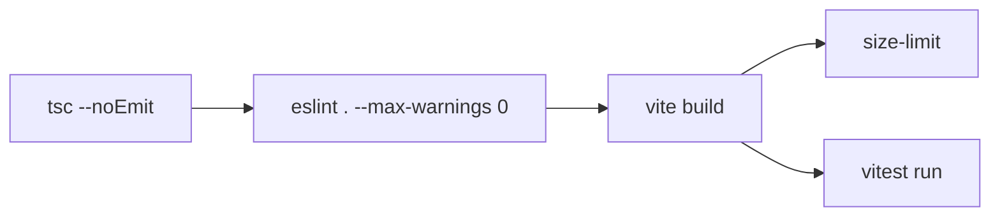

# Vanguard UI Kit — Project Structure Reference

> Use this document as a blueprint when creating other **vanguard edition** projects.
> Every directory, file, and naming convention is documented below.

---

## Root Files

| File / Dir | Purpose |
|---|---|
| `package.json` | Dependencies, scripts, exports, `size-limit`, publish config |
| `pnpm-workspace.yaml` | Single-package workspace (ready for multi-package expansion); `allowBuilds: [esbuild]` |
| `pnpm-lock.yaml` | Lockfile (pnpm only — no `package-lock.json` or `yarn.lock`) |
| `tsconfig.json` | TypeScript 6 config: `bundler` resolution, `react-jsx`, strict mode; includes `src/`, excludes `src/examples/` |
| `tsconfig.node.json` | TS config for Node-side files (Vite config, scripts) |
| `vite.config.ts` | Vite 8 build — library mode (ES + CJS output), `@tailwindcss/vite` plugin, `vite-plugin-dts` for `.d.ts` declarations |
| `vitest.config.ts` | Vitest 4 config: jsdom environment, CSS enabled, Storybook integration tests in Chromium via `@vitest/browser` + `playwright` |
| `eslint.config.js` | Flat config (ESLint 10): `@eslint/js`, `typescript-eslint`, `eslint-plugin-react-hooks` v7, `eslint-plugin-react-refresh`, `eslint-plugin-storybook` |
| `.prettierrc` | Prettier formatter config |
| `.editorconfig` | Editor settings across IDEs |
| `.gitignore` | Ignores: `node_modules/`, `dist/`, `.env`, `package-lock.json`, `.vite/`, `coverage/`, `storybook-static/` |
| `index.html` | Vite dev server entry point |
| `CHANGELOG.md` | Release changelog |
| `README.md` | Project readme with install/usage badges |
| `LICENSE` | MIT license |
| `TASKS.md` | Development task tracker (low-tech alternative to issues) |
| `COMPONENT_GUIDE.md` | Internal guide for component authors |
| `PROJECT_STRUCTURE.md` | This file |

### CI / CD

| File | Purpose |
|---|---|
| `.github/workflows/ci.yml` | PR checks: lint → type-check → test → build → size-limit |
| `.github/workflows/release.yml` | npm publish triggered on tag push |

---

## `src/` — Source Code

```
src/
├── components/
│   └── ui/
│       ├── index.ts              ← Barrel (auto-generated by scripts/generate-barrel.ts)
│       ├── <component>.tsx       ← Component implementation
│       ├── <component>.test.tsx  ← Co-located test (Vitest + testing-library)
│       └── <component>.stories.tsx ← Co-located Storybook story
│
├── hooks/
│   ├── use-<name>.ts            ← Custom React hook
│   ├── use-<name>.test.tsx      ← Hook test
│   └── index.ts                 ← Hook barrel (manual)
│
├── lib/
│   ├── utils.ts                 ← cn() class merge utility (clsx + tailwind-merge)
│   ├── tailwind-utils.ts        ← Emboss shadow helpers: getEmbossShadow(), withActiveShadow(), etc.
│   ├── <util>.ts                ← Other utilities (embla carousel, upload, etc.)
│   └── index.ts                 ← Lib barrel (manual)
│
├── providers/
│   └── <provider>.tsx           ← React context providers (e.g. ThemeProvider)
│
├── styles/
│   ├── globals.css              ← Tailwind v4 entry: @import "tailwindcss" + @theme tokens + CSS variables + utilities
│   └── presets.css              ← Animation utility classes (anim-fade-in, anim-scale-in, etc.)
│
├── tokens/
│   ├── colors.ts                ← JS color token constants (light/dark theme HSL values)
│   └── shadows.ts               ← JS shadow token constants (out/in, standard/small, light/dark)
│
├── test/
│   ├── setup.ts                 ← Vitest global setup: jest-dom matchers, ResizeObserver/IntersectionObserver mocks
│   └── utils.ts                 ← Test helper utilities
│
├── types/
│   └── <type>.ts                ← Shared TypeScript types/interfaces
│
├── App.tsx                      ← Dev sandbox entry (not exported)
├── main.tsx                     ← Dev sandbox bootstrap (not exported)
├── vite-env.d.ts                ← TS type declarations for CSS imports
└── index.ts                     ← (optional) top-level barrel re-export
```

### Naming Conventions

| Artifact | Convention | Example |
|---|---|---|
| Component file | `kebab-case.tsx` | `button-group.tsx` |
| Component export | `PascalCase` | `ButtonGroup` |
| Test file | `<name>.test.tsx` | `button-group.test.tsx` |
| Story file | `<name>.stories.tsx` | `button-group.stories.tsx` |
| Hook file | `kebab-case.ts` | `use-intersection-observer.ts` |
| Hook export | `camelCase` | `useIntersectionObserver` |
| Lib file | `kebab-case.ts` | `cn.ts`, `embla-carousel.ts` |
| Style file | `kebab-case.css` | `emboss-theme.css` |
| Token file | `kebab-case.ts` | `colors.ts`, `shadows.ts` |
| Provider file | `kebab-case.tsx` | `theme-provider.tsx` |

---

### Component Barrel (`src/components/ui/index.ts`)

- **Auto-generated** by `scripts/generate-barrel.ts` — never edit manually.
- Imports `../../styles/globals.css` so consumers get design tokens automatically.
- Re-exports every component file (skips `.test.*`, `.stories.*`, `.spec.*`).
- Consumers import from `vanguard-emboss-uikit` (maps to this barrel via `package.json` `exports` field).

---

### Canonical Component Pattern (`button.tsx`)

Every component follows this structure:

```tsx
import { cn } from '../../lib/utils'
import { getEmbossBackground, withActiveShadow } from '../../lib/tailwind-utils'
import { cva, type VariantProps } from 'class-variance-authority'
import * as React from 'react'

// 1. cva variant definitions with emboss utilities
const buttonVariants = cva(
  cn(
    getEmbossBackground(),                     // ← theme-aware background
    'inline-flex items-center justify-center ...',
    'spring-press',                            // ← spring physics transition
    'focus-visible:outline-none ...',
    'disabled:pointer-events-none ...'
  ),
  {
    variants: {
      variant: {
        default: withActiveShadow('out', 'small'),
        accent: cn(withActiveShadow('out', 'small'), 'bg-emboss-accent-blue ...'),
        outline: 'border ...',
        ghost: '...',
        link: '...',
      },
      size: { sm: '...', md: '...', lg: '...' },
    },
    defaultVariants: { variant: 'default', size: 'md' },
  }
)

// 2. Exported props interface
export interface ButtonProps extends React.ButtonHTMLAttributes<HTMLButtonElement>,
  VariantProps<typeof buttonVariants> {
  asChild?: boolean
  loading?: boolean
}

// 3. ForwardedRef component
export const Button = React.forwardRef<HTMLButtonElement, ButtonProps>(
  function Button({ className, variant, size, asChild, loading, disabled, children, ...props }, ref) {
    // asChild support via @radix-ui/react-slot
    // loading spinner rendering
    // className merging via cn()
  }
)
Button.displayName = 'Button'

// 4. Variants exported separately for composition
export { buttonVariants }
```

Key rules:
- **`cn()`** wraps every dynamic className — merges cva variants + consumer className.
- **`React.forwardRef`** — every interactive component supports ref forwarding.
- **`displayName`** — set explicitly (component name matches filename).
- **Emboss utilities** — `getEmbossBackground()`, `withActiveShadow()`, `getAccentColor()`, etc. from `lib/tailwind-utils.ts`.
- **`asChild`** — optional polymorphic prop via `@radix-ui/react-slot`.

---

### Available Emboss Utilities (`src/lib/tailwind-utils.ts`)

| Helper | Returns | Purpose |
|---|---|---|
| `getEmbossBackground()` | `"bg-emboss-bg-light dark:bg-emboss-bg-dark"` | Theme-aware background |
| `getEmbossBorder()` | `"border-emboss-shadow-light/30 dark:border-emboss-shadow-dark/30"` | Theme-aware border |
| `getEmbossShadow(type, size)` | Tailwind shadow classes | Single emboss shadow |
| `withActiveShadow(type, size)` | Tailwind shadow + `active:` variant | Press-state shadow swap |
| `withDataStateShadow(state, type, size)` | Tailwind shadow + `data-[state]:` variant | Radix state shadow swap |
| `getAccentColor(color)` | `{ text, bg, border, ring }` object | Accent color variants |

---

### Emboss Shadow System (`src/tokens/shadows.ts` + `globals.css`)

8 shadow variants derived from the core 45° light-source principle:

| Light Theme | Dark Theme |
|---|---|
| `emboss-out-light` — 9px/9px/#cbd2db, -9px/-9px/#fff | `emboss-out-dark` — 9px/9px/#13171c, -9px/-9px/#353d4a |
| `emboss-out-light-sm` — 4px/4px variant | `emboss-out-dark-sm` — 4px/4px variant |
| `emboss-in-light` — inset 6px/6px | `emboss-in-dark` — inset 6px/6px |
| `emboss-in-light-sm` — inset 3px/3px | `emboss-in-dark-sm` — inset 3px/3px |

Usage in Tailwind: `shadow-emboss-out-light dark:shadow-emboss-out-dark`

---

### Design Token Architecture (Two Layers)

**Layer 1 — Raw HSL Variables** (in `globals.css` `:root` / `.dark`):

```css
:root {
  --emboss-bg-light: 210 20% 94%;
  --emboss-highlight-light: 0 0% 100%;
  --emboss-shadow-light: 210 16% 80%;
  --emboss-accent-blue: 217 91% 60%;
  --radius: 1.5rem;
}
```
Consumers override these for full theme customization via higher-specificity `:root`.

**Layer 2 — Tailwind v4 `@theme` Tokens** (in `globals.css` `@theme` block):

```css
@theme {
  --color-emboss-bg-light: #eceef1;
  --color-emboss-highlight-light: #ffffff;
  --color-emboss-shadow-light: #cbd2db;
  --shadow-emboss-out-light: 9px 9px 16px rgb(203, 210, 219), -9px -9px 16px rgb(255, 255, 255);
  --color-background: hsl(var(--background));
  --radius-lg: var(--radius);
}
```
Maps raw variables to Tailwind utility classes (`bg-emboss-bg-light`, `shadow-emboss-out-light`).

---

### Hooks (`src/hooks/`)

| Hook | Exports | Purpose |
|---|---|---|
| `use-intersection-observer.ts` | `useIntersectionObserver` | Element visibility tracking |
| `use-animation.ts` | `useAnimation` | Animation lifecycle control |
| `use-toast.ts` | `useToast`, `toast`, `ToastData`, `ToastVariant` | Toast notification state |
| `use-keyboard-shortcut.ts` | `useKeyboardShortcut`, `KeyModifier`, `KeyboardShortcutOptions` | Keyboard shortcut binding |

---

### Providers (`src/providers/`)

| Provider | Exports | Purpose |
|---|---|---|
| `theme-provider.tsx` | `ThemeProvider`, `useTheme` | Light/dark theme context with localStorage + system preference detection |

---

## `src/styles/` — CSS Architecture

| File | Role | Contents |
|---|---|---|
| `globals.css` | **Entry point** — imported by barrel | `@import "tailwindcss"`, `@import "tw-animate-css"`, `@theme` token block, `@variant dark`, `@layer base` (CSS variables + semantic shadcn mapping + body styles), `@layer utilities` (spring physics classes), animation CSS custom properties (`--anim-*`) |
| `presets.css` | **Optional addon** — imported as `'vanguard-emboss-uikit/presets'` | `@layer utilities` with `anim-*` classes (fade-in/out, scale-in, slide-up/down) using `--anim-*` custom properties |

Key differences from Tailwind v3:
- No `tailwind.config.js` — all theme in CSS `@theme` block.
- No PostCSS — `@tailwindcss/vite` plugin handles compilation.
- `tw-animate-css` replaces `tailwindcss-animate` (CSS-based, no JS).
- `@variant dark (&:is(.dark *))` replaces `darkMode: 'class'`.

---

## `src/tokens/` — JavaScript Token Constants

| File | Purpose |
|---|---|
| `colors.ts` | Light/dark theme colors as `const` objects (background, highlight, shadow, 3 accent colors) |
| `shadows.ts` | 8 emboss shadow definitions with `ShadowTheme`, `ShadowType`, `ShadowSize` types |

These JS tokens mirror the CSS variables in `globals.css`. They exist for programmatic access (e.g., in Storybook controls or dynamic style computation). The CSS variables are the **source of truth** for rendering; these are for tooling.

---

## `scripts/` — Build & Codegen

| File | Purpose |
|---|---|
| `scripts/generate-barrel.ts` | Scans `src/components/ui/`, parses exports from each file, regenerates `index.ts` with all re-exports and a CSS import. |
| `scripts/generate-registry.ts` | Scans `src/components/ui/`, generates `registry/index.json` manifest + per-component JSON files with base64-encoded source for CLI scaffolding. |

Run via: `pnpm build:registry` (called as part of `pnpm build:all`).

---

## `registry/` — CLI Scaffolding Metadata

```
registry/
├── index.json              ← Manifest: project metadata + component list categorized by group
└── ui/
    └── <component>.json    ← Per-component: name, type, dependencies, registryDependencies, files[{path, type, content(base64)}]
```

Generated by `generate-registry.ts`. Used by consumer CLI tools (shadcn/ui-style `add` command) to fetch component source + dependencies.

---

## `src/examples/` — Examples Directory (excluded from build)

```
src/examples/
├── <example>.tsx           ← Full example apps/demos for dev reference
└── ...
```

Excluded from production build via `tsconfig.json` `exclude: ["src/examples"]`. These are development-only sandbox examples, not compiled or published.

---

## `dist/` — Build Output (gitignored)

```
dist/
├── vanguard-emboss-uikit.es.js    ← ES module bundle
├── vanguard-emboss-uikit.cjs.js   ← CommonJS bundle
├── vanguard-emboss-uikit.css      ← Compiled styles (Tailwind v4 + presets)
└── components/ui/                 ← Generated .d.ts type declarations (one per component)
└── hooks/                         ← Generated .d.ts type declarations
└── lib/                           ← Generated .d.ts type declarations
```

Generated by `vite build`. The `package.json` `main` / `module` / `types` / `exports` fields map to these files.

---

## `docs/` — Documentation

| File | Purpose |
|---|---|
| `docs/DEPENDENCIES.md` | Dependencies audit report (versions, CVEs, upgrade history) |
| `docs/IMPLEMENTATION_PLAN.md` | Architectural plan, milestones, and task tracking |
| `docs/Coding Agent Brief_Vanguard Emboss.md` | Instructions for AI coding assistants |
| `docs/Vanguard Emboss UI Kit Guide.md` | Consumer usage guide with examples |

---

## Package Manager & Workspace

- **pnpm only** — no npm or yarn lockfiles allowed.
- `pnpm-workspace.yaml` currently declares only `allowBuilds: [esbuild]` (no multi-package workspaces yet). Ready for `packages/` expansion.
- Strict dependency resolution via pnpm.

---

## Build Pipeline



| Step | Tool | Config | Output |
|---|---|---|---|
| Type check | `tsc --noEmit` | `tsconfig.json` | Type errors |
| Lint | `eslint .` | `eslint.config.js` (flat config) | Lint errors |
| Build | `vite build` | `vite.config.ts` | `dist/` (ES + CJS + CSS + .d.ts) |
| Test | `vitest run` | `vitest.config.ts` | Test results + coverage |
| Size | `size-limit` | `package.json` size-limit block | Bundle size report |

---

## Scripts Reference (`package.json` scripts)

| Command | Action |
|---|---|
| `pnpm dev` | Start Vite dev server |
| `pnpm build` | `tsc -b && vite build` |
| `pnpm build:all` | Full build + registry generation |
| `pnpm build:registry` | Generate barrel + registry JSON |
| `pnpm test` | `vitest run` |
| `pnpm test:watch` | `vitest` (watch mode) |
| `pnpm test:coverage` | `vitest run --coverage` |
| `pnpm type-check` | `tsc --noEmit` |
| `pnpm lint` | `eslint . --max-warnings 0` |
| `pnpm format` | `prettier --write "src/**/*.{ts,tsx,css,json}"` |
| `pnpm format:check` | `prettier --check "src/**/*.{ts,tsx,css,json}"` |
| `pnpm size` | `size-limit` |
| `pnpm clean` | Remove `dist/`, `.vite/`, `coverage/` |
| `pnpm storybook` | Start Storybook dev server |
| `pnpm build-storybook` | Build Storybook static site |

---

## Key Technology Versions

| Tech | Version | Notes |
|---|---|---|
| TypeScript | ^6.0.3 | Bundler resolution; `vite-env.d.ts` required for CSS import types |
| React | ^19.2.6 | peerDep widened to `^18.2.0 \|\| ^19.0.0` |
| Tailwind CSS | ^4.3.0 | No `tailwind.config.js`; `@theme` in CSS; `@tailwindcss/vite` plugin |
| Animations | `tw-animate-css` 1.4.0 | CSS-based animation library; replaces `tailwindcss-animate` |
| Vitest | ^4.1.7 | jsdom + Storybook browser tests via `@vitest/browser` + Playwright |
| ESLint | ^10.4.0 | Flat config only (no `.eslintrc.*`) |
| Vite | ^8.0.0 | Library mode with `vite-plugin-dts` |
| pnpm | 11.1.1 | Single workspace |

---

## Dependencies Overview

**Runtime (peerDependencies):** `react`, `react-dom`

**Runtime (dependencies):** `class-variance-authority`, `clsx`, `tailwind-merge`, `@radix-ui/react-slot`, `lucide-react` (and other Radix primitives as needed)

**Dev (devDependencies):** `typescript`, `vite`, `vite-plugin-dts`, `vitest`, `@vitest/browser`, `playwright`, `@testing-library/react`, `@testing-library/jest-dom/vitest`, `eslint` + plugins, `prettier`, `size-limit`, `@size-limit/*`, `storybook`, `@storybook/*`, `@chromatic-com/storybook`

---

## Adding a New Component — Step-by-Step

1. **Create component file**: `src/components/ui/<name>.tsx`
   - Follow the canonical pattern (cva + forwardRef + displayName + cn()).
   - Use emboss utilities for theme-aware shadows.
2. **Create test**: `src/components/ui/<name>.test.tsx` (co-located).
3. **Create story**: `src/components/ui/<name>.stories.tsx` (co-located).
4. **Run barrel generator**: `pnpm build:registry` — regenerates `index.ts` + registry JSON.
5. **Verify**: `pnpm build && pnpm test && pnpm lint && pnpm type-check`.
6. **Update docs**: Add to `COMPONENT_GUIDE.md` if needed.

---

## Key Decision Records

| Decision | Rationale |
|---|---|
| **Co-located tests & stories** | One file per component — no `__tests__/` or `stories/` subdirectories. Keeps imports relative, discovery instant, and removals clean. |
| **Auto-generated barrel** | Never edit `src/components/ui/index.ts` manually. The generator script parses real exports from each file, avoiding stale/incorrect re-exports. |
| **CSS-first tokens** | Tailwind v4 `@theme` block instead of JS config file. Consumers override CSS variables, not import a JS theme file — zero-bundle-overhead customization. |
| **Library mode build** | Vite `build.lib` produces ESM (`.es.js`) + CJS (`.cjs.js`) + separate CSS file. Type declarations per component via `vite-plugin-dts`. |
| **Global CSS in barrel** | `globals.css` is imported from the barrel entry point, not by consumers — they get design tokens automatically when they import any component. |
| **`tw-animate-css` over `tailwindcss-animate`** | Tailwind v4 compatible; CSS-based (no JS config); works with `@theme` block natively. |
| **Flat ESLint config** | ESLint 10 requires flat config. Single `eslint.config.js` replaces legacy `.eslintrc.*` chain. |
| **Separate `tsconfig.node.json`** | Keeps Node-side files (Vite config, scripts) out of the main `tsconfig.json` compilation context, avoiding type conflicts. |
| **`pnpm-workspace.yaml` without `packages/`** | Single-package now, but ready for monorepo expansion (e.g., separate `packages/react`, `packages/vue`, `packages/docs`). |
